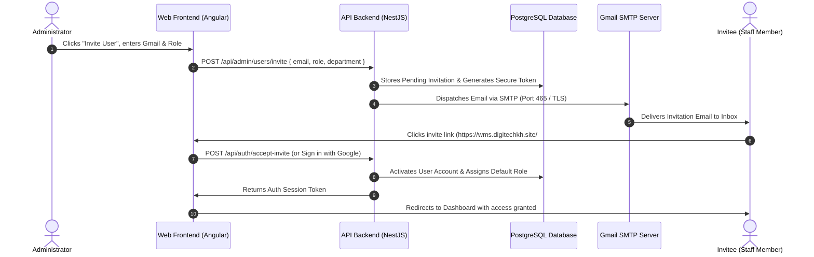

# Gmail Invitation Setup & Implementation Guide

This guide explains how to configure Google Gmail SMTP to send automated user invitations from the **WMS Digitech** platform, along with the end-to-end architecture and implementation details.

---

## 1. How It Works



---

## 2. Step-by-Step: Google Account Configuration

To allow the backend server to send emails using your Gmail address, Google requires an **App Password** (this keeps your main Google account password secure).

### Step 2.1: Turn on 2-Step Verification
1. Open [Google Account Security](https://myaccount.google.com/security).
2. Under the **"How you sign in to Google"** section, click **2-Step Verification**.
3. Follow the prompts to enable it (if not already enabled).

### Step 2.2: Generate an App Password
1. Navigate directly to [Google App Passwords](https://myaccount.google.com/apppasswords).
2. Enter an application name (e.g., `WMS Digitech`).
3. Click **Create**.
4. Google will display a **16-character code** (example: `abcd efgh ijkl mnop`).
5. **Copy this code** (you will not be able to view it again).

---

## 3. Environment Variables Configuration

Open your backend environment file [`api/.env`](file:///d:/WFM/api/.env) and configure the following:

```env
# ==============================================================================
# EMAIL / GMAIL SMTP CONFIGURATION
# ==============================================================================
SES_SMTP_HOST=smtp.gmail.com
SES_SMTP_PORT=465
SES_SMTP_USERNAME=yourcompany@gmail.com
SES_SMTP_PASSWORD=abcd efgh ijkl mnop
SES_FROM_EMAIL=yourcompany@gmail.com

# ==============================================================================
# FRONTEND URL (For generating the invitation link)
# ==============================================================================
FRONTEND_URL=https://wms.digitechkh.site
```

> [!NOTE]
> - `SES_SMTP_PASSWORD`: You can paste the 16-character password with or without spaces.
> - `SES_FROM_EMAIL`: Must match the Gmail address in `SES_SMTP_USERNAME`.
> - For local development, set `FRONTEND_URL=http://localhost:4002`.

---

## 4. Technical Implementation Details

### 4.1 Backend Architecture
1. **SMTP Service**:
   - [`api/src/app/shared/mail/ses.service.ts`](file:///d:/WFM/api/src/app/shared/mail/ses.service.ts) already handles raw TLS socket connections to port `465` (compatible with `smtp.gmail.com`).
2. **Invitation Endpoints**:
   - `POST /api/admin/users/invite`: Admin creates invitation.
     - Payload: `{ email: string, role: string, department?: string, position?: string, name?: string }`
     - Validates that user does not already exist with that email.
     - Generates JWT or signed UUID token with a 7-day expiration.
     - Formats a branded HTML email template with Digitech logo and an "Accept Invitation" CTA button.
   - `GET /api/auth/invite/verify?token=...`: Verifies token validity before showing acceptance form.
   - `POST /api/auth/invite/accept`: Completes onboarding by setting password and personal details, or linking with Google OAuth (`google-login.service.ts`).

### 4.2 Frontend Architecture
1. **Admin Staff List** ([`web/src/app/resources/3-admin/2-users/`](file:///d:/WFM/web/src/app/resources/3-admin/2-users/)):
   - Add an **"អញ្ជើញបុគ្គលិក / Invite Staff"** button next to **"បង្កើតបុគ្គលិកថ្មី / Add Staff"**.
   - Opens a dialog to input Gmail address, Role dropdown, and Department.
2. **Invitation Acceptance Page** (`web/src/app/resources/1-account/1-auth/accept-invite/`):
   - Reads token from query param `?token=...`.
   - Displays:
     - Welcome message & designated role.
     - One-click **"Continue with Google"** button (pre-fills with verified Gmail).
     - Or manual name & password setup fields.

---

## 5. Limits & Best Practices

| Provider | Daily Limit | Recommended Usage |
| :--- | :--- | :--- |
| **Free Gmail (@gmail.com)** | 500 emails / day | Internal team invites & testing |
| **Google Workspace (Custom Domain)** | 2,000 emails / day | Production operations |

---

## 6. Checklist to Go Live

- [ ] Obtain 16-character App Password from Google.
- [ ] Add `SES_SMTP_*` variables to `api/.env` (local and production).
- [ ] Implement `InviteUserDto` and invite controller endpoint in API.
- [ ] Implement Invite dialog in Staff Angular component.
- [ ] Implement public `#/auth/accept-invite` route.
