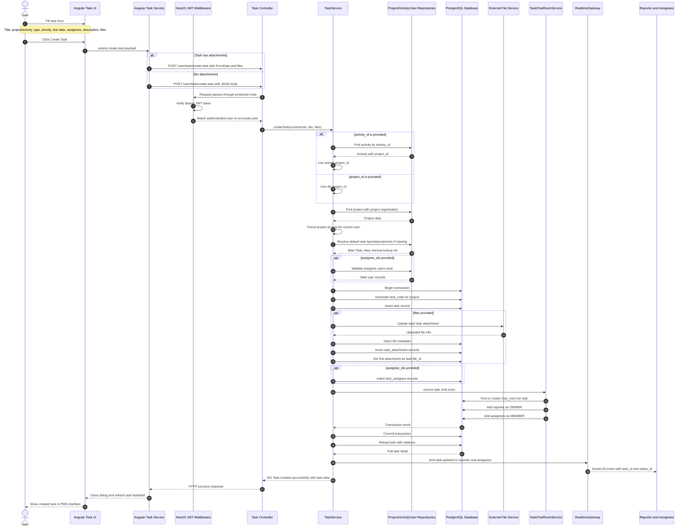

# Create Task Sequence Diagram

## Introduction

This document explains the create task process in the PMS project. The sequence is based on the actual project structure in the Angular frontend and NestJS backend. In PMS, a task can be created from different screens such as the member task page, project work tab, activity view, organization admin project view, or super admin project view. Even though the entry screens are different, the main backend process uses the shared `TaskService.createTask()` method.

The create task process does more than insert one task record. It validates the authenticated user, checks project access, resolves default task setup values, validates assignees, uploads attachments, creates task assignment records, creates a task chat room, adds chat members, returns the created task detail, and sends realtime updates to related users.

## Participants

| Participant | Role in Create Task Process |
|---|---|
| User | The member, organization admin, or super admin who fills in the task form and submits it. |
| Angular Task UI | The frontend page or dialog used to create a task. Examples include task list, project work tab, and activity task creation dialog. |
| Angular Task Service | Builds the HTTP request. It sends JSON when there are no files and `FormData` when task attachments are included. |
| NestJS JWT Middleware | Validates the Bearer token and stores the authenticated user in `res.locals.user`. |
| Task Controller | Receives `POST /user/task/create-task` or another role-based create-task endpoint and forwards the request to the shared task service. |
| Task Service | Main backend business logic for creating the task. It validates project/activity access, resolves defaults, creates the task, assigns users, attaches files, creates chat room, and sends realtime events. |
| Project, Activity, and User Repositories | Read project, activity, and assignee data from PostgreSQL for validation. |
| PostgreSQL Database | Stores task, task assignee, task attachment, file metadata, chat room, and chat member records. |
| File Service | Uploads task attachment files to the external file service and stores file metadata. |
| Task Chat Room Service | Creates or finds a task chat room and adds the reporter and assignees as chat members. |
| Realtime Gateway | Sends Socket.IO `task:updated` events to the task reporter and assignees. |
| Affected Users | Reporter and assigned members who receive updated task information or realtime refresh events. |

## Sequence Diagram

## Process Explanation

The process starts when the user opens a create task form in the Angular frontend. The same shared create task dialog can be opened from different PMS areas, such as the member dashboard, task list, project detail page, activity detail page, organization admin project page, or super admin project page. This design allows PMS to reuse one task creation experience instead of building separate logic for every page.

When the user submits the form, the frontend task service prepares the request. If the task has files, the frontend uses `FormData` and sends the files under the `files` field. If there are no files, it sends a normal JSON body. The main member endpoint is `POST /user/task/create-task`, while other role-specific project pages can call their own create-task endpoints and still reach the shared backend task service.

Before the request reaches the controller logic, the NestJS JWT middleware validates the Bearer token. If the token is missing, expired, or invalid, the request is rejected. If the token is valid, the authenticated user is attached to `res.locals.user`, and the controller passes that user into `TaskService.createTask()`.

Inside the task service, PMS first decides which project the task belongs to. If `activity_id` is provided, the system loads the activity and uses the activity's `project_id`. If no activity is provided, the task uses the submitted `project_id`. After that, PMS loads the project and checks whether the current user has access to it.

The service then resolves task setup data. If the request does not provide task type, status, or priority, the backend uses default lookup values: `Main Task` for type, `New` for status, and `Normal` for priority. This helps the frontend create tasks with minimum required input while keeping backend data complete.

Next, PMS validates assignees. If `assignee_ids` are submitted, the backend checks that each assignee exists in the user table. This prevents creating task assignment records for invalid users.

After validation, the backend starts a database transaction. Inside the transaction, it creates a task code, inserts the task record, uploads files if provided, stores file metadata, inserts task attachment rows, saves task assignee rows, and ensures a task chat room exists. The transaction is important because all related task data should be saved together. If an important part fails, the database can roll back instead of leaving incomplete task data.

The task chat room service affects the collaboration part of PMS. When a task is created, the system creates or finds a chat room for that task. The task creator becomes the chat room owner, and assigned users become chat members. This means communication is prepared immediately when the task is created.

After the transaction commits, the task service reloads the task with relations and returns a full task detail response. It also sends a realtime `task:updated` event through the Socket.IO realtime gateway to the reporter and assigned users. This helps other users' task lists or dashboards refresh without waiting for manual reload.

## How Create Task Affects Other Participants

| Affected Participant | Effect |
|---|---|
| Task Creator | Becomes the reporter of the task and the owner of the task chat room. |
| Assigned Members | Receive task assignment records and are added as members of the task chat room. |
| Project | Gains a new task connected to the project workflow and project task statistics. |
| Activity | If the task is created under an activity, the activity gains another related task for tracking progress. |
| File Service | Stores uploaded task attachments and returns metadata used by PMS. |
| Database | Stores the new task, assignees, attachments, file metadata, chat room, and chat members. |
| Task Chat | A task-specific chat room is prepared so team members can discuss the task. |
| Realtime Gateway | Sends `task:updated` events to the reporter and assignees. |
| Dashboards and Reports | New task data can affect task counts, project progress, assignee workload, and report output. |

## Summary

The create task process is one of the central workflows in PMS. It connects project management, activity planning, user assignment, file upload, task chat, database storage, and realtime updates. Because one task affects many parts of the system, PMS uses validation and a database transaction to keep the data consistent.

This workflow also shows how the system is designed for collaboration. After a task is created, assignees are connected to the task, a chat room is prepared, files are attached, and realtime updates are sent to related users. This makes task creation not only a data-entry action, but also a collaboration trigger inside the PMS project.
