# PMS Logical Architecture Diagram

## Introduction

The PMS project uses a layered logical architecture. The system is divided into a frontend application, backend API modules, shared business services, domain models, persistence, realtime communication, and external integration services. This structure separates user interface concerns from business logic and data management, making the system easier to maintain, extend, and test.

The frontend is an Angular application organized by user role and feature area. It contains authentication, layout, navigation, realtime socket handling, and role-based pages for members, organization administrators, and super administrators. The backend is a NestJS application organized into routed resource modules and shared services. Controllers receive HTTP requests, services process business rules, TypeORM entities represent the database model, and common guards/middleware/interceptors handle authentication, authorization, request formatting, and error handling.

## Logical Architecture Diagram

```mermaid
flowchart TB
    subgraph Frontend["Frontend Layer: Angular Web App"]
        UI[Role-Based UI Pages]
        AUTH_UI[Auth Module<br/>Sign in, OTP, Google, Telegram]
        MEMBER_UI[Member Area<br/>Home, Tasks, Activities, Projects, Reports]
        ORG_UI[Organization Admin Area<br/>Projects, Members, Reports, Organization Settings]
        SUP_UI[Super Admin Area<br/>Dashboard, Projects, Organizations, Users, Settings]
        SHARED_UI[Shared UI Components<br/>Project View, Task Create, Dialogs, Uploads, Skeletons]
        CORE_UI[Core Services<br/>Auth Interceptor, Guards, User, Navigation, Realtime Socket]
    end

    subgraph ApiEntry["API Entry and Routing Layer: NestJS"]
        APP[AppModule]
        ROUTER[RouterModule<br/>/auth, /user, /org-admin, /sup-admin, /account, /shared]
        MIDDLEWARE[JWT Middleware]
        GUARDS[Role and Access Guards]
        INTERCEPTORS[Interceptors and Filters<br/>Logging, snake_case response, Telegram exception filter]
    end

    subgraph ResourceLayer["Resource / Controller Layer"]
        AUTH_API[Auth and Account Controllers]
        USER_API[Member/User Controllers]
        ORG_API[Organization Admin Controllers]
        SUP_API[Super Admin Controllers]
        SHARED_API[Shared Controllers<br/>Setup, Task Detail, Meeting]
    end

    subgraph ServiceLayer["Business Service Layer"]
        USER_SVC[User and Role Services]
        PROJECT_SVC[Project Services<br/>Info, Message, Statistic, Team]
        TASK_SVC[Task Services<br/>Create, Plan, Detail, Chat, Attachment, Management]
        ACTIVITY_SVC[Activity Services<br/>Create, Plan, Recent Activity]
        ORG_SVC[Organization Access and Member Services]
        REPORT_SVC[Report and Performance Services]
        TECH_SVC[Technical Services<br/>Checklist, Credential, Mockup, Technology]
        OTP_SVC[OTP and Auth Session Services]
        FILE_SVC[File Service]
        REALTIME_SVC[Realtime Gateway]
    end

    subgraph DomainLayer["Domain Model Layer: TypeORM Entities"]
        USER_DOMAIN[User Domain<br/>User, Role, Permission, Sessions, OTP, Devices]
        ORG_DOMAIN[Organization Domain<br/>Organization, Member, Position]
        PROJECT_DOMAIN[Project Domain<br/>Project, Member, Role, Technical, Milestone, Epic, Roadmap]
        TASK_DOMAIN[Task Domain<br/>Task, Assignee, Status, Type, Priority, Attachment, Log]
        ACTIVITY_DOMAIN[Activity Domain<br/>Activity, Assignee, Attachment, Status]
        CHAT_DOMAIN[Chat Domain<br/>Room, Member, Message, Attachment, Message Type]
        REPORT_DOMAIN[Report, Notification, File, Audit, Meeting, Custom Field]
    end

    subgraph DataLayer["Data Access Layer"]
        TYPEORM[TypeORM Repositories]
        DB[(PostgreSQL Database)]
        CACHE[(Redis Cache)]
    end

    subgraph IntegrationLayer["External Integration Layer"]
        FILE_EXTERNAL[External File Service]
        GOOGLE[Google OAuth]
        TELEGRAM[Telegram Bot / Gateway]
        SMS[SMS OTP Gateway]
        EMAIL[Gmail SMTP]
        JSREPORT[JS Report Service]
    end

    UI --> AUTH_UI
    UI --> MEMBER_UI
    UI --> ORG_UI
    UI --> SUP_UI
    UI --> SHARED_UI
    UI --> CORE_UI

    CORE_UI -->|Bearer JWT HTTP requests| ROUTER
    CORE_UI -->|Socket.IO events| REALTIME_SVC
    AUTH_UI --> AUTH_API
    MEMBER_UI --> USER_API
    ORG_UI --> ORG_API
    SUP_UI --> SUP_API
    SHARED_UI --> SHARED_API

    APP --> ROUTER
    ROUTER --> MIDDLEWARE
    MIDDLEWARE --> GUARDS
    GUARDS --> INTERCEPTORS
    INTERCEPTORS --> ResourceLayer

    AUTH_API --> USER_SVC
    AUTH_API --> OTP_SVC
    USER_API --> TASK_SVC
    USER_API --> ACTIVITY_SVC
    USER_API --> PROJECT_SVC
    USER_API --> REPORT_SVC
    ORG_API --> ORG_SVC
    ORG_API --> PROJECT_SVC
    ORG_API --> TASK_SVC
    SUP_API --> USER_SVC
    SUP_API --> ORG_SVC
    SUP_API --> PROJECT_SVC
    SUP_API --> TASK_SVC
    SHARED_API --> TASK_SVC
    SHARED_API --> PROJECT_SVC
    SHARED_API --> REPORT_SVC

    USER_SVC --> USER_DOMAIN
    ORG_SVC --> ORG_DOMAIN
    PROJECT_SVC --> PROJECT_DOMAIN
    TASK_SVC --> TASK_DOMAIN
    TASK_SVC --> CHAT_DOMAIN
    ACTIVITY_SVC --> ACTIVITY_DOMAIN
    REPORT_SVC --> REPORT_DOMAIN
    TECH_SVC --> PROJECT_DOMAIN
    OTP_SVC --> USER_DOMAIN
    FILE_SVC --> REPORT_DOMAIN
    REALTIME_SVC --> TASK_SVC

    USER_DOMAIN --> TYPEORM
    ORG_DOMAIN --> TYPEORM
    PROJECT_DOMAIN --> TYPEORM
    TASK_DOMAIN --> TYPEORM
    ACTIVITY_DOMAIN --> TYPEORM
    CHAT_DOMAIN --> TYPEORM
    REPORT_DOMAIN --> TYPEORM
    TYPEORM --> DB
    ServiceLayer --> CACHE

    FILE_SVC --> FILE_EXTERNAL
    OTP_SVC --> SMS
    OTP_SVC --> EMAIL
    OTP_SVC --> TELEGRAM
    AUTH_API --> GOOGLE
    AUTH_API --> TELEGRAM
    REPORT_SVC --> JSREPORT
    REALTIME_SVC --> CORE_UI
```

## Architecture Explanation

The logical architecture starts with the Angular frontend. The frontend is organized around user roles and system features. Public authentication pages handle login and OTP. Protected routes are separated into member, organization administrator, and super administrator areas. Shared frontend components such as project view, task creation, dialogs, upload components, and skeleton loading components are reused across those role-based areas.

The Angular core layer provides common client-side behavior. The authentication interceptor attaches the JWT bearer token to protected API requests. Route guards protect authenticated and unauthenticated pages. The navigation and user services manage application state for the current user. The realtime socket service connects to the backend realtime namespace and listens for events such as `task:updated`.

The backend entry layer is the NestJS `AppModule`. It registers configuration, TypeORM, cache support, shared modules, realtime support, account/auth modules, member modules, organization admin modules, and super admin modules. The backend routes are grouped into major API areas: `/auth`, `/user`, `/org-admin`, `/sup-admin`, `/account`, and `/shared`.

Before a request reaches business logic, it passes through common backend concerns. The JWT middleware validates protected requests. Role and access utilities enforce authorization. Interceptors and filters handle logging, response formatting, snake_case conversion, and Telegram exception reporting. These cross-cutting components keep repeated security and formatting logic out of individual feature services.

The controller layer is responsible for accepting HTTP requests, validating DTOs, reading the authenticated user from the request, and calling the correct service method. Controllers are grouped by business area and role. For example, member controllers expose user task, activity, project, home, and report features, while organization admin and super admin controllers expose wider management operations.

The business service layer contains the main PMS rules. Task services handle task creation, assignment, status changes, attachments, task detail, task chat rooms, planning views, and realtime updates. Project services handle project information, project messages, team data, and statistics. Activity services handle activity creation, activity planning, and recent activity. User, role, organization, report, technical, OTP, file, and realtime services each own their respective logic.

The domain model layer is implemented with TypeORM entities. These entities define the main business objects and relationships used by PMS, including users, roles, permissions, organizations, projects, project members, tasks, assignees, activities, chat rooms, chat messages, files, meetings, notifications, audit logs, reports, and custom fields.

The data access layer uses TypeORM repositories to read and write PostgreSQL data. PostgreSQL stores the permanent PMS state across multiple schemas such as `user`, `organization`, `project`, `task`, `activity`, `chat`, `file`, `notification`, and `report`. Redis is configured as a cache/session support component for runtime data.

The integration layer contains services outside the PMS core. The backend connects to a file service for uploads and file access, Google OAuth for Google sign-in, Telegram for login/OTP/notifications, SMS and Gmail SMTP for OTP delivery, and a JS report service for report generation.

## Main Logical Layers

- **Presentation Layer**: Angular pages, layouts, shared components, dialogs, and role-based screens.
- **Client Core Layer**: Angular guards, auth interceptor, user state, navigation, translation, and realtime socket service.
- **API Routing Layer**: NestJS route grouping for auth, user, organization admin, super admin, account, and shared APIs.
- **Controller Layer**: Request validation and delegation from HTTP endpoints to service methods.
- **Business Service Layer**: PMS business rules for tasks, projects, activities, users, organizations, reports, files, OTP, and realtime events.
- **Domain Model Layer**: TypeORM entity classes that represent PMS business data.
- **Data Access Layer**: TypeORM repositories, PostgreSQL persistence, and Redis cache support.
- **Integration Layer**: File service, Google OAuth, Telegram, SMS gateway, Gmail SMTP, and JS report service.

## Role-Based Logical Areas

- **Member/User Area**: Home dashboard, personal tasks, activities, projects, project detail, and personal reports.
- **Organization Admin Area**: Organization-level projects, members, reports, organization settings, task settings, and member statistics.
- **Super Admin Area**: System-level dashboard, project management, organization management, user management, and global settings.
- **Account Area**: Authentication, profile, QR login, OTP, password reset, Google login, Telegram login, and two-factor settings.

## Key Logical Data Flow

1. The user interacts with an Angular page or shared component.
2. Angular core services attach authentication data and send HTTP or socket requests.
3. NestJS routing directs the request to the correct role-based controller.
4. Middleware, guards, interceptors, and filters apply authentication, authorization, formatting, and error handling.
5. Controllers call shared business services.
6. Services apply PMS rules and use TypeORM repositories.
7. TypeORM reads or writes PostgreSQL entities.
8. Services call external integrations when needed.
9. The backend returns a response or emits realtime events.
10. The frontend updates the user interface.

## Summary

The PMS logical architecture is organized around separation of responsibilities. Angular handles presentation and client-side state, NestJS handles API routing and business logic, TypeORM entities define the domain model, PostgreSQL stores persistent data, Redis supports runtime caching, and external services provide specialized capabilities such as file upload, authentication, OTP, Telegram messaging, and reporting. This architecture supports role-based workflows while keeping common logic reusable through shared frontend components and backend shared services.

