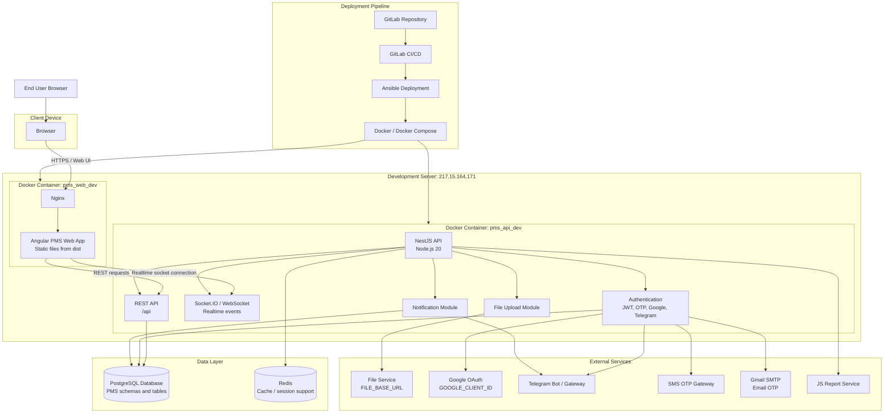

# PMS Physical Architecture Diagram

## Introduction

The PMS project is built as a web-based project management system with two main deployable applications: an Angular frontend and a NestJS backend API. The frontend is compiled into static files and served by an Nginx container. The backend runs as a Node.js container and provides REST APIs, authentication, task/project/business logic, realtime socket events, file integration, notification integration, and database access.

In the development deployment found in this project, both the web and API services are deployed to the same target server IP, `217.15.164.171`, using GitLab CI/CD and Ansible. The web application is exposed through an Nginx Docker container on port `2411`, while the backend API is exposed through a Node/NestJS Docker container on port `2410`. The backend connects to PostgreSQL for persistent data, Redis for cache/session support, and several external services for file upload, OTP, Google login, Telegram, and report generation.

## Physical Architecture Diagram

## Architecture Explanation

The physical architecture separates the PMS system into client, web server, backend API, data layer, external services, and deployment pipeline.

The user accesses PMS from a browser. The browser loads the Angular frontend from the Nginx container. In the current development deployment, the web container is named `pms_web_dev` and maps host port `2411` to container port `80`. The frontend is a static Angular build located in the `dist` directory and served by Nginx.

After the frontend loads, it communicates with the backend API using HTTP requests. The configured development API base URL is `https://pms-api.dev.camcyber.com/api`. The frontend also supports realtime communication through Socket.IO/WebSocket using the configured socket URL `https://pms-api.dev.camcyber.com`.

The backend API runs in a separate Docker container named `pms_api_dev`. It is built from `DockerfileProd`, uses Node.js 20, and starts the compiled NestJS application. The container maps host port `2410` to application port `3000`. The backend is responsible for all business logic, including users, organizations, projects, activities, tasks, task chat, reports, notifications, file records, authentication, OTP, and realtime updates.

PostgreSQL is the main persistent database. The backend uses TypeORM to map entities into multiple PostgreSQL schemas such as `user`, `organization`, `project`, `task`, `activity`, `chat`, `file`, `notification`, `report`, and others. These tables store the core PMS data, including users, roles, projects, tasks, assignees, chat rooms, chat messages, attachments, audit logs, and reports.

Redis is configured as a supporting infrastructure service. It is used through NestJS cache manager and Redis-related packages, mainly for cache/session-style runtime support. The Redis host and port are provided through environment variables.

The backend also connects to external services. Google OAuth is used for Google login. Telegram is used for Telegram login, OTP, and organization/system log notifications. SMS and Gmail SMTP are used as OTP delivery channels. A file service is used for file upload and file access through `FILE_BASE_URL`. A JS report service is configured for report generation.

Deployment is automated through GitLab CI/CD and Ansible. The GitLab pipeline runs for the `dev` branch, loads environment variables, builds the project, and executes deployment scripts. Ansible prepares directories on the target server, manages Docker containers, builds the API container, and starts the web/API services. This makes the physical deployment repeatable and separates source code management from server runtime operation.

## Main Physical Components

- **Client Browser**: Runs the PMS user interface and sends API/socket requests.
- **Nginx Web Container**: Serves the built Angular frontend from `dist`.
- **NestJS API Container**: Runs the backend application and exposes `/api`.
- **PostgreSQL Database**: Stores all persistent PMS business data.
- **Redis**: Provides cache/session support.
- **File Service**: Stores and serves uploaded files.
- **Google OAuth**: Provides Google sign-in support.
- **Telegram Services**: Support Telegram login, OTP, and notifications.
- **SMS and Gmail SMTP**: Provide OTP delivery channels.
- **JS Report Service**: Supports report generation.
- **GitLab CI/CD and Ansible**: Build and deploy the system to the server.

## Deployment Notes

- Web deployment target from the repository: `217.15.164.171`.
- API deployment target from the repository: `217.15.164.171`.
- Web container: `pms_web_dev`.
- API container: `pms_api_dev`.
- Web port mapping: `2411:80`.
- API port mapping: `2410:3000`.
- API global prefix: `api`.
- Frontend development API URL: `https://pms-api.dev.camcyber.com/api`.
- Frontend development socket URL: `https://pms-api.dev.camcyber.com`.

## Summary

The PMS physical architecture uses a clear client-server structure. The Angular frontend is delivered by Nginx, the NestJS backend handles business logic and realtime communication, PostgreSQL stores permanent data, Redis supports runtime caching/session needs, and external services provide authentication, OTP, file handling, Telegram messaging, and reporting. GitLab CI/CD with Ansible and Docker provides the deployment mechanism for running the PMS services on the development server.

