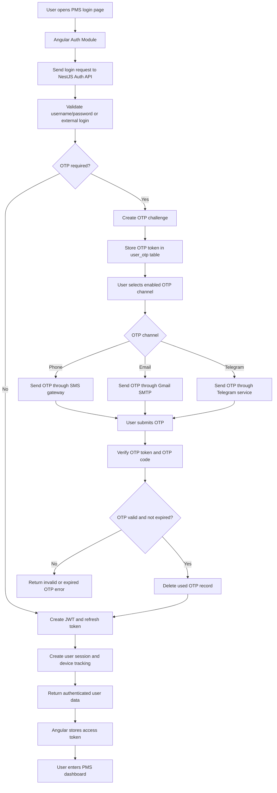
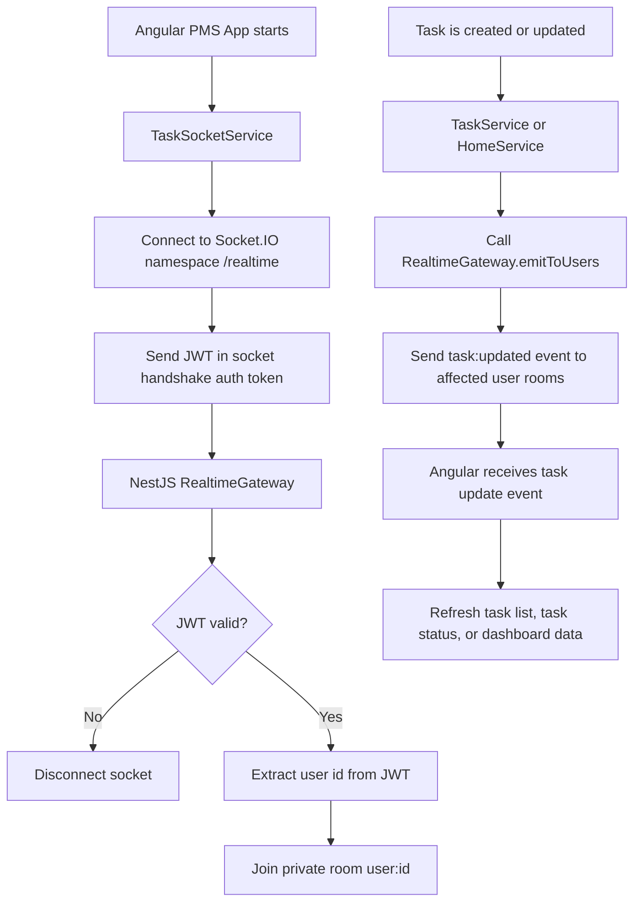
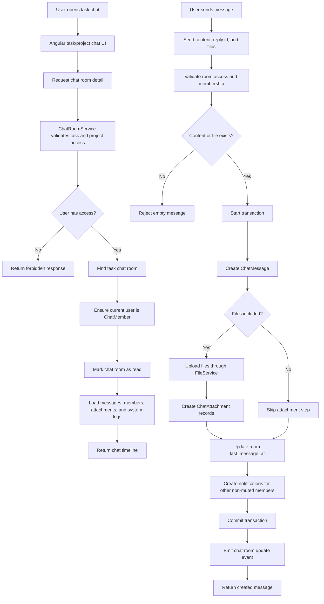
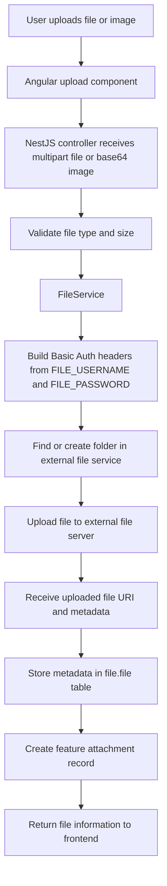
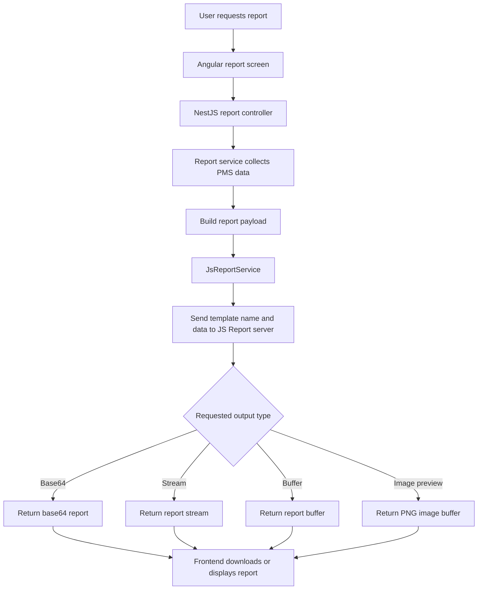
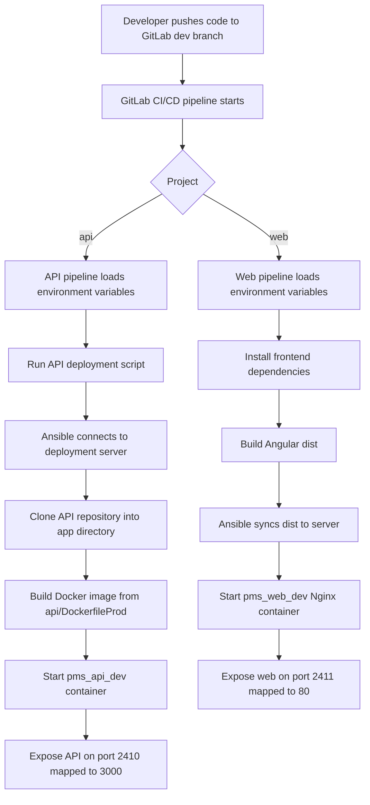

# PMS Project Implementation Diagrams

## Introduction

The PMS project is implemented with several important backend and frontend logic flows. These flows are more specialized than normal CRUD operations because they connect multiple modules, servers, services, and database tables. The most important special implementations in PMS are authentication with OTP, realtime task updates, task chat, file upload, report generation, and automated deployment.

This document provides implementation diagrams and explanations for these special parts of the PMS project. The diagrams are based on the actual `PMS_project` structure, including the Angular frontend in `web/` and the NestJS backend in `api/`.

## 1. Authentication and OTP Implementation

### Diagram

### Explanation

The authentication logic is handled by the backend auth modules and shared OTP services. The Angular frontend sends login requests to the backend. The backend validates the login method, checks whether OTP is required, and either returns tokens immediately or creates an OTP challenge.

The OTP implementation uses `OtpService` and `OtpDeliveryService`. OTP settings are stored per user, and users can enable phone, email, or Telegram OTP. OTP records are stored temporarily in the `user_otp` table with an expiry time. After successful verification, the OTP record is deleted so it cannot be reused.

This implementation improves account security because sensitive login and password reset actions can require a second verification step.

## 2. Realtime Task Update Implementation

### Diagram

### Explanation

PMS uses a dedicated realtime gateway for live task updates. The frontend service `TaskSocketService` connects to the backend Socket.IO namespace `/realtime` and sends the same JWT used for HTTP authentication.

The backend `RealtimeGateway` verifies the JWT during socket connection. If the token is valid, the socket joins a private room named `user:<id>`. Backend services can then emit events only to affected users. For example, when a task is created or assigned, the backend emits `task:updated` to the reporter and assignees.

This implementation prevents the frontend from constantly polling the server and allows task changes to appear quickly for users who are affected by the change.

## 3. Task Chat Implementation

### Diagram

### Explanation

Task chat is implemented with `ChatRoomService`, `TaskChatRoomService`, and the chat entities. Each task can have a chat room with `type = task`. When a task is created, PMS ensures a matching chat room exists and adds the task creator and assignees as chat members.

When users open a chat, the backend validates that the task and project exist and that the user has access. If the user has project access but is not yet a chat member, PMS automatically adds the user as a member. The chat timeline includes normal chat messages and system messages from task activity logs and project audit logs.

When a message is sent, the backend saves the message and attachments inside a transaction, updates the room activity time, creates notifications for other members, and emits a chat update event. This keeps task discussion connected directly to the task workflow.

## 4. File Upload Implementation

### Diagram

### Explanation

PMS separates actual file storage from PMS business data. The backend `FileService` communicates with the external file service using environment variables such as `FILE_BASE_URL`, `FILE_USERNAME`, `FILE_PASSWORD`, `FILE_UPLOAD_PROJECT_ID`, and `FILE_UPLOAD_FOLDER_ID`.

After a file is uploaded externally, PMS stores the file metadata in the internal `file.file` table. Feature-specific attachment tables then link the file to tasks, activities, chat messages, projects, users, or other modules.

This implementation keeps the PMS database focused on metadata and relationships while the file service handles physical file storage.

## 5. Report Generation Implementation

### Diagram

### Explanation

Report generation is implemented through `JsReportService`. PMS collects report data from tasks, projects, activities, users, and performance services, then sends that data to the JS Report server. The report service is configured by `JS_BASE_URL`, `JS_USERNAME`, and `JS_PASSWORD`.

The implementation supports multiple output modes, including base64, stream, buffer, and image preview. This allows different report screens to download PDFs, preview report images, or handle generated files in memory.

## 6. Deployment Implementation

### Diagram

### Explanation

The PMS project includes deployment automation for both `api/` and `web/`. GitLab CI/CD starts deployment jobs for the `dev` branch. The API deployment uses Ansible and Docker Compose to build and run the NestJS backend container. The frontend deployment builds the Angular `dist` folder and serves it using an Nginx container.

The development deployment configuration uses the target server IP `217.15.164.171`. The API container is named `pms_api_dev` and maps `2410:3000`. The web container is named `pms_web_dev` and maps `2411:80`.

This deployment implementation separates source code, build steps, and runtime containers, making the project easier to deploy consistently.

## Summary

The PMS project contains several important implementation flows beyond basic CRUD. Authentication uses JWT and OTP channels. Realtime task updates use Socket.IO and private user rooms. Task chat combines chat messages, attachments, notifications, and activity logs. File upload uses an external file service while storing metadata in PMS. Reports are generated through JS Report. Deployment uses GitLab CI/CD, Ansible, Docker, Node.js, and Nginx.

Together, these implementations support the main PMS features: secure login, live task updates, task-based collaboration, document handling, reporting, and repeatable deployment.

