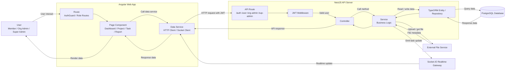

# 5.2.2 Logical Architecture

## Introduction

The PMS project uses a simple layered logical architecture. The frontend is an Angular web application, and the backend is a NestJS API server. Users interact with Angular pages, Angular sends HTTP requests to the API, the API routes the request to controllers and services, and the services use TypeORM models to read or write data in PostgreSQL.

This architecture separates the user interface from business logic and database logic. It helps the PMS project support different roles such as Member, Organization Admin, and Super Admin while keeping the main workflow clear.

## Logical Architecture Diagram

**Figure: Simple logical architecture of PMS project**

## Explanation

The logical architecture starts from the user. The user can be a Member, Organization Admin, or Super Admin. Each role has different pages and permissions in the Angular frontend. For example, members can manage their tasks and projects, organization admins can manage organization projects and members, and super admins can manage users, organizations, settings, and project data.

In the Angular web app, the route layer controls page access. The frontend uses guards such as `AuthGuard`, `NoAuthGuard`, and role redirect logic to decide which pages a user can open. After the route is allowed, the page component displays the interface and collects user actions such as login, create task, assign task, upload file, view report, or update project information.

The Angular data service layer sends requests to the backend API. For normal data operations, it sends HTTP requests with the JWT token. For live updates, it connects to Socket.IO and listens for realtime events such as task updates.

On the backend, the NestJS API route receives the request. PMS backend routes are grouped by feature and role, including `/auth`, `/user`, `/org-admin`, `/sup-admin`, `/account`, and `/shared`. Protected requests pass through the JWT middleware, which validates the Bearer token and identifies the current user.

After authentication, the controller receives the request and calls the correct service. Controllers are responsible for receiving request data, applying DTO validation, and forwarding the request to business logic. The service layer contains the main PMS rules, such as creating tasks, assigning users, checking project access, creating activity records, managing reports, uploading files, and sending realtime updates.

The service layer uses TypeORM entities and repositories as the model layer. These models represent the PMS database tables, such as users, organizations, projects, tasks, task assignees, activities, chat rooms, files, notifications, meetings, and reports. TypeORM sends queries to the PostgreSQL database and returns the result back through the service and controller to the Angular frontend.

Some services also communicate with external systems. The file service is used when users upload task attachments, profile images, organization logos, or report files. The realtime gateway is used to send Socket.IO updates to affected users, especially when task data changes.

## Simple Data Flow

1. The user interacts with an Angular page.
2. Angular route guards check whether the user can access that page.
3. The Angular component calls an Angular data service.
4. The data service sends an HTTP request to the NestJS API.
5. JWT middleware validates the user token.
6. The controller forwards the request to the service.
7. The service applies PMS business logic.
8. TypeORM repositories read or write PostgreSQL data.
9. The backend returns response data to Angular.
10. Angular renders the updated data for the user.
11. If needed, Socket.IO sends realtime updates to related users.

## Summary

This simple logical architecture shows that PMS is divided into three main logical parts: frontend, backend, and database. The Angular frontend handles user interaction, the NestJS backend handles business logic, and PostgreSQL stores the main project data. External services such as the file service and Socket.IO realtime gateway support file upload and live task updates.
