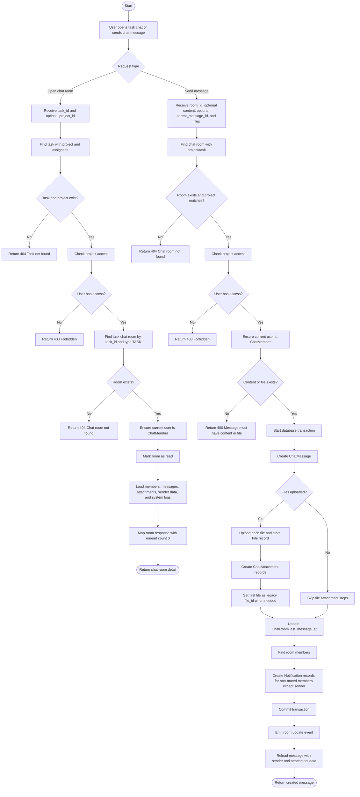

# Task Chat Activity Diagram

## Description

Task chat allows authorized project users to communicate inside a specific task. Each task has one task-type chat room linked by `task_id`. When a user opens the task chat, the system validates project access, loads the room, ensures the user is a chat member, marks the room as read, and returns the conversation timeline. When a user sends a message, the system validates the room, saves the message and any uploaded files, updates the room's latest activity time, creates notifications for other non-muted members, emits a room update event, and returns the created message.

## Activity Diagram

## Explanation

The task chat process starts from the task module endpoints such as `GET /api/user/task/chatroom` and `POST /api/user/task/chatroom/message`. The controller forwards the authenticated user and request data to `ChatRoomService`.

For viewing chat, the service first verifies that the task exists, has an active project, and belongs to the requested project when `project_id` is provided. Access is granted to a super administrator, the project creator, a project member, or an organization administrator of the project. After access is confirmed, the system loads the task chat room, adds the current user as a room member if they are not already a member, marks the room as read, and returns the full timeline.

The returned timeline combines normal user messages from `chat.chat_message` with system messages generated from task activity logs and project audit logs. This lets users see both conversation messages and important task/project history in one chat view.

For sending chat, the service validates the chat room and project access, ensures membership, then checks that the request contains either text content or at least one uploaded file. The message creation runs inside a database transaction. It creates the `ChatMessage`, uploads and stores files when provided, creates `ChatAttachment` rows, updates `ChatRoom.last_message_at`, and creates notifications for other non-muted room members. After the transaction succeeds, the service emits a room update event and returns the newly created message.

## Main Database Tables

- `chat.chat_room`: Stores the task chat room. For task chat, `type` is `task` and `task_id` links the room to `task.task`.
- `chat.chat_member`: Stores users who participate in the room, their chat role, mute state, and read state.
- `chat.chat_message`: Stores text/file messages, sender, optional reply parent, message type, and edit/delete timestamps.
- `chat.chat_attachment`: Links uploaded file records to chat messages.
- `file.file`: Stores uploaded file metadata.
- `notification.notification`: Stores notifications created for other room members after a message is sent.
- `task.task_activity_log`: Provides task system messages shown in the chat timeline.
- `audit.audit_log`: Provides project system messages shown in the chat timeline.

## Alternative Flows

- If the task does not exist, is deleted, or its project is missing/deleted, the system returns `Task not found`.
- If the chat room does not exist, the system returns `Chat room not found`.
- If the current user does not have project access, the system returns a forbidden response.
- If a user sends a message without content and without files, the system rejects the request.
- If the user is not yet a `ChatMember` but has project access, the system automatically adds them to the room as a member.
