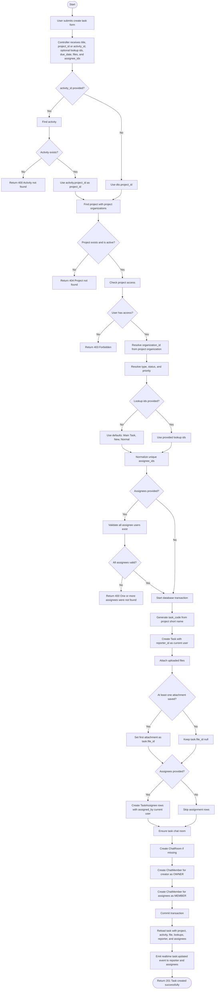

# Create and Assign Task Activity Diagram

## Description

The create-and-assign task process creates a new task inside a project or under an existing activity. The system validates the project/activity, checks user access, resolves default task lookup values, validates assignees, saves the task and its attachments inside a transaction, creates task assignment records, ensures a task chat room exists, sends realtime updates, and returns the complete task detail.

## Activity Diagram

## Explanation

The direct create task flow starts from `POST /api/user/task/create-task`. The request supports a project task or an activity task. If `activity_id` is provided, the system first loads the activity and uses the activity's `project_id`; otherwise it uses the `project_id` from the request.

After the project is found, the service checks whether the current user can access the project. The allowed users are super administrators, the project creator, project members, and organization administrators for the project. If the user is not allowed, task creation stops before any data is written.

Next, the system resolves the task lookup values. If the request does not include `type_id`, `status_id`, or `priority_id`, the service uses the organization's default lookup rows: `Main Task`, `New`, and `Normal`. Assignee IDs are normalized to unique numeric IDs. If assignees are provided, every assignee must exist in the user table.

The database write runs inside one transaction. The service generates a task code, creates the `task.task` row, saves uploaded attachments, optionally sets the first attachment as the task's main `file_id`, and creates one `task.task_assignee` row for each assignee. Each assignment stores the assignee user and the user who assigned them.

Before the transaction finishes, the service ensures that the task has a chat room. It creates a `chat.chat_room` with `type = task` if one does not already exist, then adds the creator as the room owner and each assignee as a room member. This means the task is ready for discussion immediately after creation.

After the transaction commits, the service reloads the full task detail, emits a realtime `task:updated` event to the reporter and assignees, and returns a success response with the created task data.

## Main Database Tables

- `task.task`: Stores the task record, including project, activity, task code, title, lookup values, reporter, due date, archive flag, and main file.
- `task.task_assignee`: Stores task assignments. It has one row per assigned user and records who assigned them.
- `task.task_attachment`: Stores task attachment links.
- `file.file`: Stores uploaded file metadata.
- `project.project`: Provides project ownership, short name, and project context for task code generation.
- `activity.activity`: Optional parent activity for the task.
- `chat.chat_room`: Stores the automatically created task chat room.
- `chat.chat_member`: Stores the creator and assignees as chat participants.

## Alternative Flows

- If `activity_id` is provided but no activity exists, the system returns `Activity not found`.
- If the project is missing or deleted, the system returns `Project not found`.
- If the current user does not have project access, the system returns a forbidden response.
- If a provided assignee ID does not match an existing user, the system rejects the request.
- If no lookup IDs are provided, the system falls back to default lookup rows for task type, status, and priority.
- If no assignees are provided, the task is still created, and the creator is still added to the task chat room as owner.

